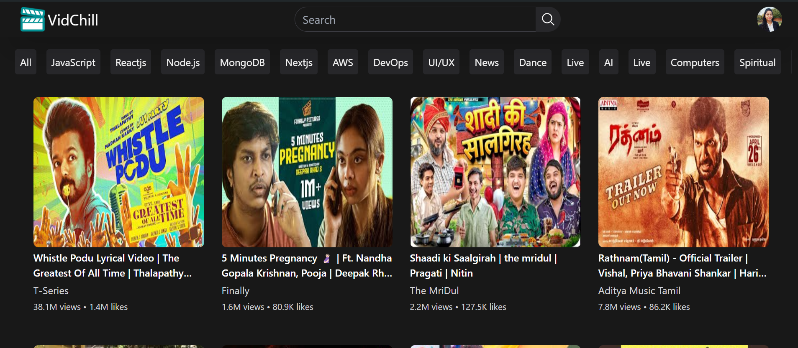
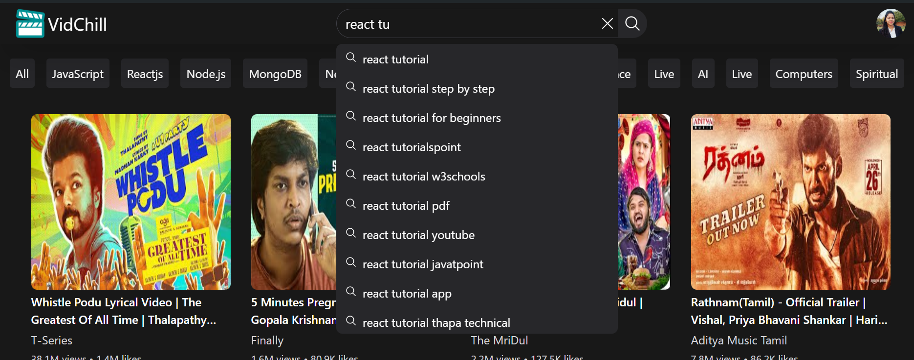
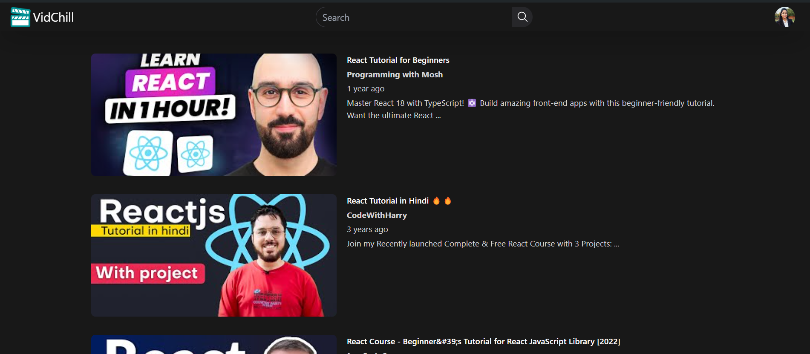

## VidChill
### This project is a video streaming application inspired by YouTube, where users can watch videos, search for content, engage in live chat, and more.

## Features : 
#### :mag: Optimised Search Suggestions: Utilizing advanced concepts like Debouncing & Caching
#### 💬 N-level Comments Section: Supports nested comments driven by Recursion
#### 🗣️ Live Chat: Enables real-time interaction just like YouTube with storage optimization
#### :arrow_double_down: Infinite Scroll: Allows users to effortlessly browse through an endless stream of content
#### 📱 Responsive Design: ensures seamless user experience across various devices

### Homepage

### Video Player & Live Chat

### Comment Section

### Search Content

## Technologies Used : 
#### React: for building UI components
#### Redux : for state management
#### Typescript : for code quality & robust type safety
#### Tailwind CSS : for styling & responsiveness

### Data Source :
#### YouTube API Integration for fetching and displaying content
